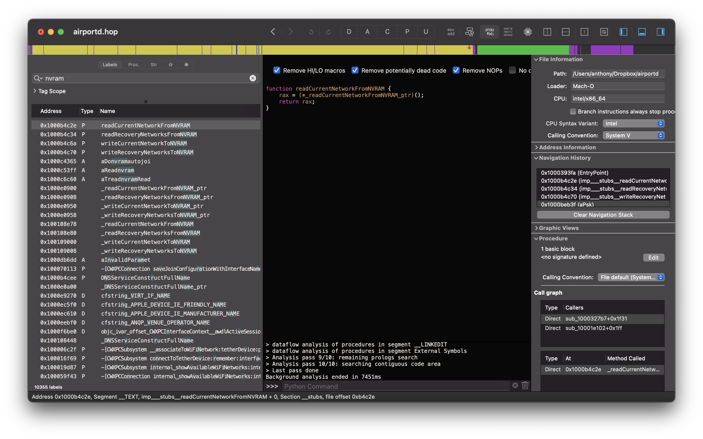
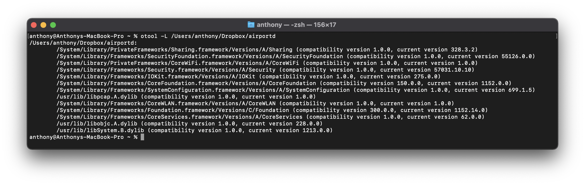
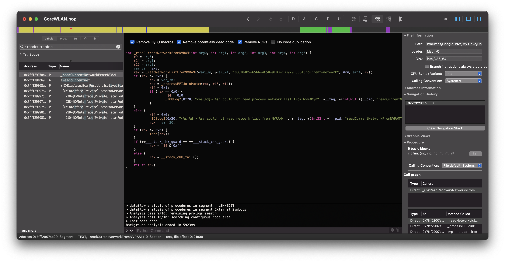
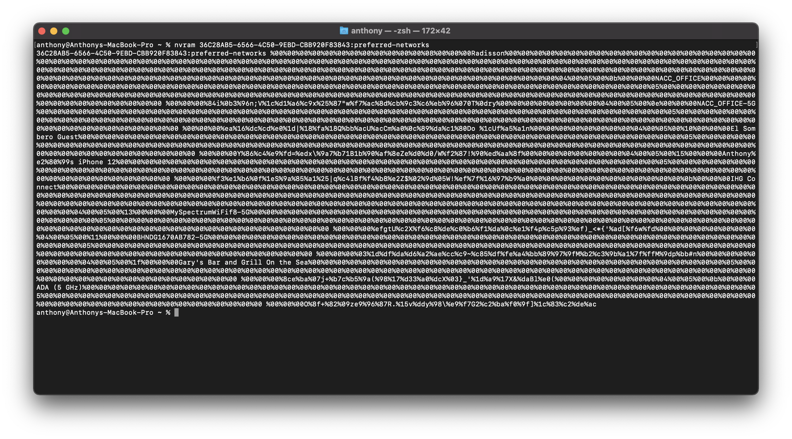
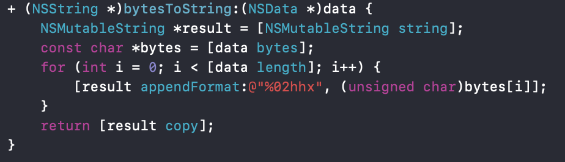

## macOS NVRAM Variables

### Background

When determining concepts to research for an independent study, I remembered about a builtin tool in macOS called `airportd` located at `/usr/libexec/airportd`. This tool allowed the user to specify a command `readNVRAM`, which would print out all of the WPA PSKs of the network passwords that the Mac has connected to (either the current network or the recovery networks). Apple has since removed that capabiliy from the `airportd` binary, although they have not removed the NVRAM variable the tool was accessing.

### Investigation

I was able to obtain a copy of the `airpotd` binary which displayed the PSKs from the recovery image of an older version of macOS. To begin, I put the binary in Hopper Disassembler and searched for the term "NVRAM".

The result of the search showed that the binary was calling an external function from a different framework titled `readCurrentNetworkFromNVRAM()`. Next, using `otool`, I looked at what other frameworks `airportd` linked against.

Using the context of what the function is called, the function that was being referenced had to either be in `CoreWiFi` or `CoreWLAN`. I dumped both, and found that it was indeed located within `CoreWLAN`.

Once the function was decompiled, it was clear to see what was happening: it gets the NVRAM data from `36C28AB5-6566-4C50-9EBD-CBB920F83843:current-network` and uses `processEFIJoinParam()` to parse it into a readable format. However, when trying to manually call `readCurrentNetworkFromNVRAM()` within Xcode, it does not return anything. After troubleshooting and trial and error, I noticed that this function had been updated to only work if run as root. The odd thing about this is that we do not need root to actually access the NVRAM variable, but only to call the function.

Looking at the output, the network names are clearly visible with the PSK of the network printed out in raw bytes next to it. This was a step in the right direction, but some kind of manipulation is required to get this output in a readable format.

### Application

To make the output something that's human readable, I decided to write a small application that gets the NVRAM data and is able to parse it. I began with the function `GetOFVariable()`. This is taken from Apple's open source website (see https://opensource.apple.com/source/system_cmds/system_cmds-279.6/nvram.tproj/nvram.c.auto.html). It purely gets the NVRAM data at a specific location and returns a `CFTypeRef`, which is essentially a generic object. Upon further testing, it actually seems to return the `NSData` representation (byte buffers) of whatever is being held at that location. Now that we know what is actually being returned, we just have to convert the bytes to a normal string. `NSString` has a builtin method titled `initWithData:` where `NSData` can be passed in, although this did not work with this type of data. So, that means that the bytes had to individually be converted to C characters and then appended to one string which would hold the final value at the end. The solution looks like this:

After getting the NVRAM data and running it through this method, we are able to successfully get the PSKs of the networks that are stored in the NVRAM of the Mac.

### Access Point Vulnerability

One thing to notice is that the NVRAM only stores the PSK of the passphrase to the network, not the passphrase itself. It's safe to say that because PSKs can be retrieved without any system privileges, a fairly bad vulnerability already exists. The problem becomes amplified though due to routers accepting the PSK of a network as the passphrase. In other words, I can copy the PSK retrieved via the sample application and paste it when trying to connect to a network, and the router will accept it, allowing me to connect to the network. The implications of this can be extremely bad, considering all it would take is for the sample application to be put on a Mac that's connected to any arbitrary network, allowing someone to connect to the same access point without permission.

### Conclusions

Even though the function of `airportd` that allowed NVRAM data for networks to be parsed has been removed, it can still be done manually and parsed yourself without root privilages. The sample application attached demonstrates this, and when taken from the Mac, the PSK can be used for anyone to connect to any network the Mac has been since routers do not have any check against this.

